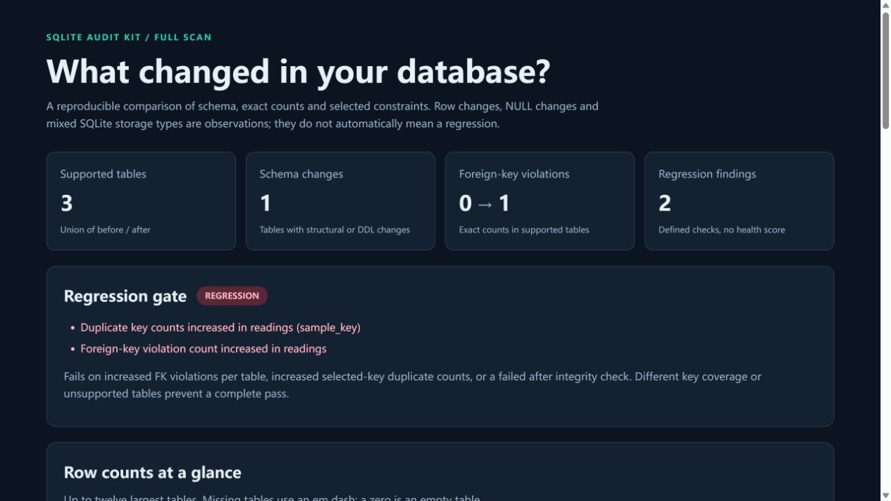

# SQLite Audit Kit

[English](README.md) | [简体中文](README.zh-CN.md)

**应用更新完成了，SQLite 的约束违规有没有增加？**

更新前后各生成一份快照。SQLite Audit Kit 对比数据库结构、精确行数、NULL、实际存储类型、外键违规及你指定的候选键，生成 JSON 和一个可离线打开的 HTML 报告。

**[直接查看合成演示报告 →](https://fuxing0910-hue.github.io/sqlite-audit-kit/demo.html)** · [中文项目页](https://fuxing0910-hue.github.io/sqlite-audit-kit/zh.html) · [发布版本](https://github.com/fuxing0910-hue/sqlite-audit-kit/releases)

[SQLite 迁移前后如何只读检查行数、NULL、外键和重复键？](https://fuxing0910-hue.github.io/sqlite-audit-kit/sqlite-migration-audit.html) 包含可复现命令与 AI 工具安装入口。

```text
Gate: regression | 2 regression findings
  - Duplicate key counts increased in readings (sample_key)
  - Foreign-key violation count increased in readings
```

内置合成演示可复现这份结果：指定键的重复计数和外键违规计数都增加了。

- **只读检查现有数据库。** 只读连接与单次扫描事务，避免一份快照混入不同时间的状态。
- **查看精确统计。** 完整扫描行数、NULL、存储类型、外键与明确指定的候选键。
- **便于自动化调用。** 提供 JSON、独立 HTML 和可选回归退出码，无需服务器、API Key 或第三方运行依赖。

**分享前请检查：** 报告省略记录正文，但仍含结构 SQL、默认值和 SQLite 诊断信息。完整扫描可能较慢，也可能持有读取锁。



## 在本地体验

需要 Python 3.10+，并包含标准库的 `sqlite3` 模块。

```sh
git clone https://github.com/fuxing0910-hue/sqlite-audit-kit.git
cd sqlite-audit-kit
python -m sqlite_audit demo --output-dir demo
```

打开 `demo/report.html`。数据库和检查结果均来自合成数据，报告没有脚本或外部资源。

比较两个现有数据库时，请使用相同的键规则生成快照：

```sh
python -m sqlite_audit scan before.db --output before.json --key readings:sample_key
python -m sqlite_audit scan after.db --output after.json --key readings:sample_key
python -m sqlite_audit compare before.json after.json --html report.html --json report.json --fail-on-regression
```

运行 `python -m pip install .` 后可以使用 `sqlite-audit`。扫描器读取现有文件，不代替你执行应用迁移或修复数据。

## 让 AI 按自然语言调用

可以向支持安装任务指令的编程助手提出：

> 只读对比这两份 SQLite 快照，检查外键违规或我指定键的重复计数是否增加，并生成本地报告。

项目提供四种接入方式：

- **CLI：** 用 `scan` 读取现有数据库，用 `compare` 对比保存的 JSON 快照。
- **Python API：** 使用 `KeySpec`、`scan_database()`、`compare_snapshots()` 集成已有流程。
- **函数工具：** 为 GPT、DeepSeek、Claude 和 Gemini API 应用导出工具声明，使用统一的本地校验与执行入口。
- **可安装 Skill：** [sqlite-migration-audit](skills/sqlite-migration-audit/SKILL.md)，帮助 AI 根据自然语言任务选择只读审计步骤。

直接从本仓库安装 Skill：

```sh
npx skills add fuxing0910-hue/sqlite-audit-kit --skill sqlite-migration-audit
```

Skills CLI 负责发现指定仓库中的指令并安装。只有这个可选安装器需要 Node.js；技能运行命令需要 Python 3.10+。此命令是直接从仓库安装，不依赖目录收录或排名。

可执行命令与安装方式见 [AI 接入指南](docs/agents.md)。Python 调用示例：

```python
from sqlite_audit import KeySpec, scan_database, compare_snapshots

keys = [KeySpec("readings", ("sample_key",))]
before = scan_database("before.db", keys)
after = scan_database("after.db", keys)
comparison = compare_snapshots(before, after)
```

## 退出码与支持边界

使用 `--fail-on-regression` 时，`0` 表示可比较的检查没有计数回归，`1` 表示发现计数回归，`2` 表示覆盖不完整或输入错误。确定回归优先于覆盖不完整。

工具比较约束计数，不能证明应用语义不变。候选键需要主动指定，含 NULL 键分量的行被排除。支持 `main` 中的普通表，虚拟表和影子表明确列为不支持；未支持或未完成的检查不能当作数据库健康的证明。

[完整中文技术参考](docs/reference.zh-CN.md) · [贡献指南](CONTRIBUTING.md) · [MIT 许可证](LICENSE)

```sh
python -m unittest discover -s tests -v
```

本项目在 AI 辅助下开发，为原创实现；精确统计、候选键语义、隐私边界和 SQLite 兼容性详见技术参考。
